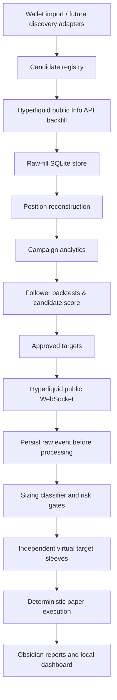

# Copy-trading research alpha

This subsystem researches publicly observable traders and paper-copies their
signals. It extends the ETH/swarm bot; it does not share state, credentials, or
the Coinbase execution path.

It is paper-only. There is no live copy execution adapter in this release.

## Architecture



The first source adapter is Hyperliquid. `HyperliquidPublicAdapter` uses the
public `/info` endpoint for `userFillsByTime`, `portfolio`, and
`clearinghouseState`, and the public websocket's safely attributable
`userFills`, `allDexsClearinghouseState`, and `allMids` subscriptions. Shared
`userEvents` and `orderUpdates` are intentionally disabled for Alpha. No page scraper is on
the real-time path. Adapters for dYdX, GMX, Drift, Nansen, Birdeye, Dune, and
centralized-exchange research sources can implement the same normalized input
models later.

## Data provenance and persistence

`copy_raw_fills` preserves source/venue/network, address, source order and
trade IDs, transaction hash, symbol, direction, price, size, notional, fee,
known equity and starting position, normalized `closedPnl`/liquidation fields,
source and ingestion timestamps,
confirmation information, and unmodified source JSON. Its deterministic event
ID makes backfill, websocket snapshots, reconnects, and restarts idempotent.

SQLite tables are deliberately isolated in `artifacts/copytrade.sqlite3`:

- `copy_targets`, `copy_raw_fills`, `copy_position_events`, and `copy_campaigns`
- `copy_trader_snapshots`, `copy_daily_metrics`, and `copy_candidate_scores`
- `copy_signals`, `copy_virtual_positions`, `copy_execution_attempts`, `copy_execution_claims`, and `copy_execution_fills`
- `copy_backtest_runs`, `copy_portfolio_snapshots`, and `copy_backfill_coverage`

The small `CopyTradeStore` contract means a PostgreSQL backend can replace the
SQLite implementation without changing the research, risk, or paper-execution
logic. A signal claim, attempt, sleeve mutation, simulated fills, and portfolio
snapshot commit in one SQLite transaction; replay after an uncommitted failure
is safe and replay after a committed attempt is a no-op.

`ExecutionAggregator` can net independent virtual sleeves into future
venue-facing execution intents while preserving every contributing sleeve. It
does not submit orders.

## Configuration and safeguards

Use [config/copytrade.yaml](../config/copytrade.yaml). It defaults to `$200`,
paper mode, public Hyperliquid mainnet data, no leverage, no target adds, and
the 5/10/20% allocation policy. Allocation is always a percentage of *free
paper cash*, not account equity, and the size baseline is the median of prior
initial entries only. Fills normally have no `accountValue`: entries are
enriched from the latest prior account-value snapshot, record source and age,
and reject stale observations from classifier history.

The same enriched `PositionEvent` objects are used by `copy-score`,
`copy-backtest`, and event-based walk-forward replay. The single equity-quality
rule accepts only prior, configured source-quality observations; missing, stale,
future, or disallowed observations fall back and never train the sizing median.

The process never promotes itself to live mode. A future implementation must
require both `COPYTRADE_MODE=live` and `COPYTRADE_LIVE_ENABLED=true`; this alpha
rejects live startup even when both are set because it includes no live order
adapter. Do not put secrets, private keys, or seeds in the YAML file.

Risk gates include a kill switch, stale signal protection, signal-age and price
deviation limits, free-capital and total/target/symbol exposure caps, virtual
campaign count, daily/target loss stops, drawdown and consecutive-loss stops,
and allow/block lists. Exposure-cap denominators are explicit; the research
default is current marked equity. Target reductions and closes proportionally
reduce the matching virtual sleeve; they cannot become reverse entries.

On watcher startup (and after each reconnect), it first receives an `allMids`
frame to warm the market cache, then reconciles from the durable latest-fill
timestamp with a one-millisecond overlap, and finally processes the subscribed
user-fill stream. There is one initial reconciliation, not a duplicate startup
pass. The websocket snapshot is also accepted. Both paths pass through the
same deterministic raw-event ID and execution-attempt boundary, so overlap is
replayed safely rather than silently skipped or copied twice.

For live paper research, `allMids` is cached as a websocket midpoint reference.
It is not described as an executable quote. New entries require a fresh cached
reference and record its source, age, timestamps, and deterioration from the
target fill before configured slippage. Stale entries are skipped; exits use the
explicit `target_fill_fallback` policy unless configured to skip. Market updates
mark open sleeves and periodically persist their equity/drawdown state without
creating an execution attempt.

## Typical workflow

```powershell
python main.py copy-import --wallet 0xYOUR_PUBLIC_WALLET
python main.py copy-backfill --wallet 0xYOUR_PUBLIC_WALLET --start 2026-01-01T00:00:00Z
python main.py copy-score --wallet 0xYOUR_PUBLIC_WALLET
python main.py copy-rank --count 7
python main.py copy-approve --wallet 0xYOUR_PUBLIC_WALLET
python main.py copy-backtest --wallet 0xYOUR_PUBLIC_WALLET --walk-forward
python main.py copy-backtest --wallet 0xYOUR_PUBLIC_WALLET --market-price-proxy
python main.py copy-report --wallet 0xYOUR_PUBLIC_WALLET
python main.py copy-watch --duration 60
python main.py copy-dashboard
```

All commands have `--help`. `copy-size-demo` makes the configured 5/10/20
classification visible using a warm historical median. `copy-watch` has an
optional bounded duration so it can be smoke-tested without leaving a process
running.

## Backtesting and candidate selection

The backtester replays reconstructed, equity-enriched position events
chronologically. Its execution engine is in-memory: it never writes operational
signals, execution attempts/fills, virtual sleeves, claims, or portfolio marks.
Only an optional `copy_backtest_runs` research record is persisted. Obsidian
follower and latency charts, as well as slippage scenarios, use the same
enriched events. It seeds size history only from events before the replay window
and supports rolling train/forward windows. Without a latency-sensitive historical market provider,
latency survivability is explicitly unavailable and is reweighted out of the
score; a shifted target-fill-price replay is never latency evidence. With a
provider, the reference price is queried at detection plus order latency and
its source, quality, timestamp, and deterioration are retained. Candle fallback
uses only a previously closed candle and labels itself a coarse prior-close
proxy, not L2. Walk-forward tests exclude campaigns already open at the forward
boundary. Diversification uses UTC-day return buckets and requires seven common
or zero-filled activity buckets before correlation is meaningful.

Candidate scoring keeps components and penalties in the database. It combines
risk-adjusted expectancy, drawdown/tails, consistency, latency survivability,
sample quality, position-size stability, diversification, and source quality,
then applies martingale, adverse-averaging, concentration, inactivity,
small-sample, and latency-decay penalties. Ranking uses return correlations so
the target set is not merely the top individual scores.

Backfill coverage has three states: `PROVEN_COMPLETE`, `UNPROVEN`, and
`KNOWN_INCOMPLETE`. Ordinary public Hyperliquid history is `UNPROVEN`: it is a
visible warning and source-quality penalty, but remains research-eligible by
default. `KNOWN_INCOMPLETE` is a hard gate. Set
`candidates.require_proven_history` only when archive-quality proof is required.

## Research outputs and dashboard

Obsidian output defaults to `artifacts/obsidian/`:

- `Copy Trading Dashboard.md`
- `Targets/<wallet>.md` with YAML frontmatter
- `Backtests/<run-id>.md`, `Reports/<date>.md`, and local SVG charts

Target notes separate target results from follower simulations and include the
equity, drawdown, rolling P&L, win/loss, holding time, position size, symbol
P&L, latency-decay, and follower-equity chart slots.

`copy-dashboard` serves a simple FastAPI/WebSocket UI with health, targets,
scores, virtual sleeves, capital, risk state, and latest fill markers. It is a
local visual aid, not a live-trading control plane.

## Tests

```powershell
python -m unittest discover -s tests
python -m unittest tests.test_copytrade -v
```

The unit tests use fixed fill fixtures only. They cover split long/short flips,
fee rebates, source-PnL reconciliation, truncated history, prior-only equity
enrichment, 5/10/20 sizing, unavailable and time-sensitive latency, candle
no-lookahead, marked long/short sleeves, partial loss risk, atomic fault replay,
restart drawdown, walk-forward boundaries, time-aligned correlation, websocket
payload shapes, official plural clearinghouse-state parsing, enriched-event
backtests, contemporaneous live-paper price deterioration, fee-risk ledgers,
coverage eligibility, and the earlier baseline behaviors.

## Hyperliquid limitations

- `userFillsByTime` is limited by the public API (2,000 fills per response and
  only the most recent 10,000 fills). The adapter records coverage metadata and
  leaves coverage `UNPROVEN`, never "complete", until an archive/indexer source
  can prove it. A saturated smallest interval is `KNOWN_INCOMPLETE`.
- The plural websocket clearinghouse record is only used when one state is
  present or when its explicit empty/default key is present. Multiple nondefault
  states are kept as ambiguous rather than silently summed.
- Websocket snapshot messages can overlap backfilled data. IDs and source-first
  persistence make the overlap safe.
- Public target fills do not recreate historical order-book depth. Backtests
  label this execution-price assumption rather than manufacturing L2 precision.
- Public wallet behavior is not proof of strategy ownership, persistence, or
  future copyability. Treat scores as research inputs, not investment advice.
