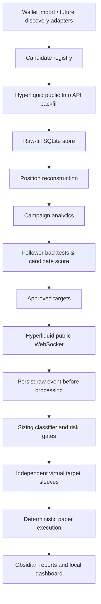

# Copy-trading research alpha

This subsystem researches publicly observable traders and paper-copies their
signals. It is the sole supported application runtime; Phase D.6 permanently
removed the unrelated ETH/Coinbase bot and its exchange client.

It is paper-only. There is no live copy execution adapter in this release.

## Architecture



The first source adapter is Hyperliquid. `HyperliquidPublicAdapter` uses the
public `/info` endpoint for `userFillsByTime`, `portfolio`, and
`clearinghouseState`, and the public websocket's safely attributable
`userFills`, `allDexsClearinghouseState`, and `allMids` subscriptions. Shared
`userEvents` and `orderUpdates` are intentionally disabled for Alpha. No page scraper is on
the real-time path. Adapters for dYdX, GMX, Drift, Nansen, Birdeye, Dune, and
centralized-exchange research sources can implement the same normalized input
models later.

## Data provenance and persistence

`copy_raw_fills` preserves source/venue/network, address, source order and
trade IDs, transaction hash, symbol, direction, price, size, notional, fee,
known equity and starting position, normalized `closedPnl`/liquidation fields,
source and ingestion timestamps,
confirmation information, and unmodified source JSON. Its deterministic event
ID makes backfill, websocket snapshots, reconnects, and restarts idempotent.

SQLite tables are deliberately isolated in `artifacts/copytrade.sqlite3`:

- `copy_targets`, `copy_raw_fills`, `copy_position_events`, and `copy_campaigns`
- `copy_trader_snapshots`, `copy_daily_metrics`, and `copy_candidate_scores`
- `copy_signals`, `copy_virtual_positions`, `copy_execution_attempts`, `copy_execution_claims`, and `copy_execution_fills`
- `copy_backtest_runs`, `copy_portfolio_snapshots`, and `copy_backfill_coverage`
- `copy_reconstruction_cursors` for versioned per-wallet incremental source reconstruction and recovery continuity state
- `copy_analysis_runs`, `copy_analysis_run_wallets`, append-only `copy_analysis_run_wallet_events`, and `copy_candidate_analyses`
- `copy_analysis_market_evidence` and `copy_analysis_finalist_recommendations` for immutable replay evidence and recommendation-only selection audit
- `phase_d_execution_intents`, `phase_d_execution_submissions`, append-only `phase_d_execution_state_events`, and `phase_d_execution_risk_decisions` for the versioned D.0 simulator execution ledger
- `phase_d_execution_fills`, `phase_d_execution_reconciliation_runs`, `phase_d_execution_reconciliation_items`, and `phase_d_execution_position_observations` for normalized venue evidence and discrepancies

The small `CopyTradeStore` contract means a PostgreSQL backend can replace the
SQLite implementation without changing the research, risk, or paper-execution
logic. A signal claim, attempt, sleeve mutation, simulated fills, and portfolio
snapshot commit in one SQLite transaction; replay after an uncommitted failure
is safe and replay after a committed attempt is a no-op.

`ExecutionAggregator` remains an inert paper-sleeve planning seam.  Alongside
it, Phase D.0 adds an independent, simulator-only execution ledger for
immutable `CopySignal → ExecutionIntent` provenance, deterministic submission
identity, explicit ambiguous-submission handling, fills, and reconciliation
evidence. It does not alter paper sleeves or reinterpret the historical
`copy_execution_*` rows. See [Phase D execution foundation](PHASE_D_EXECUTION.md).

Raw-fill batches are committed through bounded SQLite `executemany` chunks in
one transaction. Phase A completion also computes evidence counts, source and
symbol diversity, activity span, and notional proxies with SQL aggregation, so
Deep scans do not materialize every staged observation in Python memory.

## Configuration and safeguards

Use [config/copytrade.yaml](../config/copytrade.yaml). It defaults to `$200`,
paper mode, public Hyperliquid mainnet data, no leverage, no target adds, and
the 5/10/20% allocation policy. Allocation is always a percentage of *free
paper cash*, not account equity, and the size baseline is the median of prior
initial entries only. Fills normally have no `accountValue`: entries are
enriched from the latest prior account-value snapshot, record source and age,
and reject stale observations from classifier history.

The same enriched `PositionEvent` objects are used by `copy-score`,
`copy-backtest`, and event-based walk-forward replay. The single equity-quality
rule accepts only prior, configured source-quality observations; missing, stale,
future, or disallowed observations fall back and never train the sizing median.

The process never promotes itself to live mode. A future implementation must
require both `COPYTRADE_MODE=live` and `COPYTRADE_LIVE_ENABLED=true`; this alpha
rejects live startup even when both are set because it includes no live order
adapter. Do not put secrets, private keys, or seeds in the YAML file.

Risk gates include a kill switch, stale signal protection, signal-age and price
deviation limits, free-capital and total/target/symbol exposure caps, virtual
campaign count, daily/target loss stops, drawdown and consecutive-loss stops,
and allow/block lists. Exposure-cap denominators are explicit; the research
default is current marked equity. Target reductions and closes proportionally
reduce the matching virtual sleeve; they cannot become reverse entries.

## Repeatable candidate discovery

`copy-discover` builds a cheap research queue; it does not backfill, score,
approve, watch, or paper-copy a wallet. The initial native source is documented
HyperCore node data: older `node_trades` (both counterparties from
`side_info[].user`), API-shaped bare `node_fills`, and block-batched
`node_fills_by_block` (`block_*` metadata plus `events`). Block events may be a
bare fill object or the production `[wallet_address, fill_object]` pair. The
outer wallet is used only when the fill omits `user`; a fill must still provide
time (or a block timestamp), symbol, price, and size. It detects those tested
shapes explicitly and fails a valid-but-unsupported source envelope instead of
reporting a misleading zero-wallet run. No leaderboard endpoint is assumed or
scraped.

```powershell
# A locally downloaded node-data JSON/JSONL (or .lz4; lz4 is installed by requirements.txt)
python main.py copy-discover --source hypercore-file --input path\to\node_fills_by_block.jsonl --limit 1000 --min-activity 2 --max-activity-age 30d --output artifacts\discovery.json

# An exact requester-pays historical-node object; boto3 is installed by requirements.txt.
# It still requires AWS requester-pays billing authorization and configured credentials.
python main.py copy-discover --source hypercore-s3 --input s3://hl-mainnet-node-data/node_fills_by_block/DATE/HOUR --refresh

# Archive research explicitly disables the default 30-day Phase A recency gate
python main.py copy-discover --source hypercore-file --input path\to\node_trades.jsonl --max-activity-age none
```

The S3 transport sends `RequestPayer=requester` and fails clearly if AWS
requester-pays billing authorization, credentials, or the exact object are
unavailable. `boto3` and `lz4` are runtime dependencies in `requirements.txt`,
so a fresh supported install can use the documented S3 plus `.lz4` path. Error
messages identify the object and requester-pays requirement without printing
credential values.
It never falls back to a scraped or undocumented HTTP endpoint. The transport
interface also accepts local fixtures, downloaded data, local-node streams, or
a future indexer while keeping their normalized observations identical.

Discovery streams JSONL and large JSON arrays, normalizes each event, and writes
bounded SQLite batches; requester-pays S3 objects are likewise read as streams.
Within a run, a deterministic identity based on source, wallet, fill/trade ID,
hash, order ID, time, symbol, price, and size deduplicates overlapping files
before `--min-activity` or ranking. Separate runs remain append-only audit
history. Each run persists valid events, normalized observations, duplicate
events, invalid wallets, malformed events, unsupported nested records, valid
wallets, eligible wallets, registered/refreshed candidates, limit-deferred
wallets, filtered wallets, and fatal-source errors, so a `--limit` never makes
eligible wallets disappear from accounting. A malformed event inside a
recognized block is quarantined in `copy_discovery_rejections` and the remaining
events proceed; a malformed block envelope, unsupported top-level schema,
corrupt/truncated stream, or I/O failure fails the source/run explicitly and
does not register staged candidates. Successful runs with quarantined records
are marked `completed_with_warnings`; source failures are `failed`. The default
`--max-activity-age 30d` filters stale activity before Phase B; `none` disables
that gate.

For every de-duplicated wallet/run, Stage A.1 persists cheap evidence in the
candidate metadata using `evidence_schema_version: 2`. Version 2 requires the
complete `cheap_stats` contract: distinct observed events, active hours/days,
observed span, symbols and distinct-symbol count, approximate observed
notional, independent-source count, and first/last observed activity. Zero is
a finding only in a complete version-2 record. Phase B recognizes older,
incomplete, and future-version rows; it can use the legacy
`latest_activity_observations` count for the safe activity check, but never
turns absent dimensions into zero. Those rows receive the explicit
`phase_a_refresh_required` prefilter reason and require a fresh Phase-A scan
before expensive Phase-B analysis. Stage A.2 uses the configurable `prefilter`
section before any expensive public backfill. Its explainable reason codes include
`invalid_wallet`, `inactive`, `insufficient_activity`,
`insufficient_temporal_diversity`, `insufficient_temporal_span`,
`insufficient_observed_notional`, `insufficient_symbol_diversity`,
`known_incomplete`, `operator_managed_status`, and
`phase_a_refresh_required`.

Candidates are merged by normalized address, retain independent-source count,
and refresh activity/last-seen values. A new wallet is added to `copy_targets`
with status `new`; rediscovery never overwrites a manually set status.

On watcher startup (and after each reconnect), it first receives an `allMids`
frame to warm the market cache, then asks for the retained public fill range.
If a local anchor exists, an exact durable raw-fill ID must appear in that
response before continuity is accepted. A nonempty response alone is not
proof. An absent anchor persists `RECOVERY_INCOMPLETE`, records activity and a
clearinghouse-state observation, blocks `OPEN`/`ADD`, and preserves exits.
It remains fail-closed across restart; a verified flat clearinghouse state plus
an explicit safe-rebaseline command is the only route to a new zero source
baseline. Clearinghouse state is evidence only and never overwrites PAPER
sleeves or invents missing source P&L.

The live watcher does not reconstruct a wallet's full raw-fill history for
each source message. New fills are committed first, then the versioned cursor
advances in the same SQLite transaction as only the generated PositionEvents
and changed campaigns. A crash can leave durable raw evidence behind the
cursor, which safely replays; it cannot advance a cursor beyond uncommitted
reconstruction. Full reconstruction remains the explicit startup/migration,
repair, research, and validation path. Historical snapshot rebuilding seeds
prior-only target-size context but does not replay historical PAPER entries.

For live paper research, `allMids` is cached as a websocket midpoint reference.
It is not described as an executable quote. New entries require a fresh cached
reference and record its source, age, timestamps, and deterioration from the
target fill before configured slippage. Stale entries are skipped; exits use the
explicit `target_fill_fallback` policy unless configured to skip. Market updates
mark open sleeves and periodically persist their equity/drawdown state without
creating an execution attempt.

## Typical workflow

```powershell
python main.py copy-import --wallet 0xYOUR_PUBLIC_WALLET
python main.py copy-discover --source hypercore-file --input path\to\node_fills_by_block.jsonl --limit 1000 --max-activity-age 30d
python main.py copy-analyze-candidates --limit 500 --workers 4
python main.py copy-analysis-status
python main.py copy-backtest --wallet 0xYOUR_PUBLIC_WALLET --walk-forward
python main.py copy-backtest --wallet 0xYOUR_PUBLIC_WALLET --market-price-proxy
python main.py copy-report --wallet 0xYOUR_PUBLIC_WALLET
python main.py copy-control-center --with-watcher
```

All commands have `--help`. `copy-size-demo` makes the configured 5/10/20
classification visible using a warm historical median. Phase B writes its
versioned finalist recommendation and diversified selection rank to SQLite.
An operator must then use the local Control Center to activate a current
selected finalist; only that canonical Phase-C transition makes a wallet an
Active paper-entry target. `copy-approve` is research triage only and
`copy-watch` never promotes approved or Shadow wallets. `copy-watch` has an
optional bounded duration so it can be smoke-tested without leaving a process
running.

## Backtesting and candidate selection

The backtester replays reconstructed, equity-enriched position events
chronologically. Its execution engine is in-memory: it never writes operational
signals, execution attempts/fills, virtual sleeves, claims, or portfolio marks.
Only an optional `copy_backtest_runs` research record is persisted. Obsidian
follower and latency charts, as well as slippage scenarios, use the same
enriched events. It seeds size history only from events before the replay window
and supports rolling train/forward windows. Without a latency-sensitive historical market provider,
latency survivability is explicitly unavailable and is reweighted out of the
score; a shifted target-fill-price replay is never latency evidence. With a
provider, the reference price is queried at detection plus order latency and
its source, quality, timestamp, and deterioration are retained. Candle fallback
uses only a previously closed candle and labels itself a coarse prior-close
proxy, not L2. Walk-forward tests exclude campaigns already open at the forward
boundary. Diversification uses UTC-day return buckets and requires seven common
or zero-filled activity buckets before correlation is meaningful.

Candidate scoring keeps components and penalties in the database. It combines
risk-adjusted expectancy, drawdown/tails, consistency, latency survivability,
sample quality, position-size stability, diversification, and source quality,
then applies martingale, adverse-averaging, concentration, inactivity,
small-sample, and latency-decay penalties. Ranking uses return correlations so
the target set is not merely the top individual scores.

Backfill coverage has three states: `PROVEN_COMPLETE`, `UNPROVEN`, and
`KNOWN_INCOMPLETE`. Ordinary public Hyperliquid history is `UNPROVEN`: it is a
visible warning and source-quality penalty, but remains research-eligible by
default. `KNOWN_INCOMPLETE` is a hard gate. Set
`candidates.require_proven_history` only when archive-quality proof is required.

## Phase B candidate analysis

`copy-analyze-candidates` consumes the Phase A candidate universe without
changing its providers, evidence, candidate registration, or operator target
statuses. It creates an auditable analysis run and a per-wallet research
lifecycle separate from manual target status:

```text
new → prefilter_rejected
new → backfill_pending → analysis_pending → analyzed / qualified
                         ↘ backfill_failed / quarantined
```

The local prefilter rejects invalid wallets, stale activity, insufficient Phase
A evidence, and already known incomplete coverage with recorded reason codes.
Survivors use bounded, retrying public backfill workers; each worker has its
own public adapter so coverage bookkeeping cannot cross wallets. Network
ingestion persists raw data and coverage first; a wallet is reconstructed once
afterward for Phase B scoring. A failure is stored per wallet and does not
abort the remaining candidate set. Each run records an immutable candidate
manifest containing the selected candidate metadata and its versioned Phase-A
evidence snapshot, plus the analysis window and configuration fingerprint.
`--resume` restores
that manifest and invocation policy (its new CLI limit/status/worker options
are ignored), and refuses a changed copy-trading configuration rather than
mixing assumptions inside one run. Wallet stage events are append-only, while
the current wallet table is only a convenient projection; final counters are
reconstructed from that event history. Runs created before the manifest
contract keep their compatibility fallback of re-reading the current candidate
row, and are explicitly weaker than new immutable-evidence runs.

```powershell
# Cheap local sieve only; no public API calls
python main.py copy-analyze-candidates --status new --limit 500 --cheap-only

# Research-only backfill, reconstruction, follower replay, scoring, and finalists
python main.py copy-analyze-candidates --status new --limit 500 --workers 4 --output artifacts\candidate-analysis.json

# Resume the newest interrupted run with its original manifest/configuration.
# Do not pass a changed configuration; it will be rejected.
python main.py copy-analyze-candidates --resume --workers 4
python main.py copy-analyze-candidates --status new --force --limit 50

# Future-dashboard-friendly persisted rows and current run state
python main.py copy-analysis-status --limit 1000
python main.py copy-rank --count 20 --output artifacts\finalists.json
python main.py copy-suitability-report --wallet 0xYOUR_PUBLIC_WALLET --output artifacts\wallet-suitability.json
```

Phase B persists target metrics, follower metrics, sizing/equity-quality
coverage, slippage scenarios (including 0 bps), latency availability,
walk-forward evidence, transparent score components/penalties, hard gates,
confidence, deterministic pathology flags, and observed-price-proxy regime
evidence in the candidate-analysis summary. Confidence is a separate 0-100
measure of evidence depth (campaigns, active days, history span, coverage,
walk-forward windows, regime representation, and source quality); it is never
silently folded into suitability. Coverage is evaluated over the full
immutable analysis window: only continuous `PROVEN_COMPLETE` request segments
prove it; any intersecting `KNOWN_INCOMPLETE` segment quarantines it; a small
recent request can never certify old stored fills. The Follower Capture Ratio
is dimensionless: simulated follower return on initial follower capital divided
by target net P&L over a genuine usable target-equity observation. It records
the denominator, source, and quality and is `unavailable` without real target
capital, no filled follower entries, or a non-positive target return; it never
uses campaign notional or a raw-dollar follower/target P&L ratio.

The immutable analysis window also bounds the analytical population itself.
Phase B reconstructs prior source state only to identify a position already
open at the left boundary, then excludes that boundary-crossing campaign rather
than inventing an entry basis. It scores only complete campaigns whose economic
open and close are inside the saved `required_start` to `required_end` window;
post-window fills never affect target metrics, follower replay, copyability,
walk-forward, or diversification. The summary stores this boundary policy,
excluded-event counts, analyzed campaign IDs, daily return series, and bounded
symbol/directional exposure inputs. Finalists reuse those stored inputs rather
than mutable all-time campaign tables.

`KNOWN_INCOMPLETE` backfill coverage is a hard quarantine. `UNPROVEN` remains
analyzable with the existing source-quality penalty and an explicit reason.
Follower drawdown above `max_follower_drawdown_hard` and repeated liquidation
behavior above `liquidation_frequency_hard` are hard gates; lesser follower
drawdown/liquidation risk receives a transparent penalty. Sufficient stable
walk-forward windows add modest score evidence; insufficient windows are
explicitly unavailable rather than silently treated as strength. Suitability
weights are relative weights normalized across available components to a fixed
100-point gross scale before transparent penalties; changing every weight by a
common multiplier leaves a score unchanged. Latency is `unavailable` unless a
historical price path exists. Historical follower replays are in-memory
and do not write signals, execution attempts/fills, sleeves, claims, or
operational portfolio marks. Finalists must be current, eligible Phase B
qualified analyses with run-stamped Phase B scores; legacy `copy-score` rows,
pre-filter rejects, quarantines, muted/rejected targets, and active targets
cannot enter. Selection uses time-aligned correlation when enough daily
buckets exist, treats missing correlation as uncertainty, and adds symbol and
directional exposure-overlap penalties. It returns the diversification
breakdown but never changes a target state to `shadow` or `approved`.

There is exactly one authoritative `phase_b` score for each wallet/run. A
resume after a score-write crash updates that same record. During an upgrade,
pre-existing duplicate Phase B rows are copied to `copy_candidate_score_archive`
before the active uniqueness constraint is applied. Phase B-facing candidate
rows always read score, eligibility, reasons, provenance, run ID, and config
fingerprint from that one authoritative Phase B record; a later legacy/research
score is displayed separately and cannot replace it. Finalist selection
also requires the score fingerprint to equal the current configuration
fingerprint; prior qualified analyses remain auditable but are reported as
stale and are not compared with current settings. Coverage prefiltering and
backfill retry decisions use the run window, so an unrelated historical
`KNOWN_INCOMPLETE` segment cannot reject or short-circuit current work.

`copy-rank` now makes `ranked_phase_b`, `selected`, and `shadow_finalists`
canonical Phase B recommendations using that same current fingerprint and
bounded evidence. Individual Phase-B suitability remains visible even when a
candidate cannot be selected: `finalist_requirements` independently applies a
minimum confidence score and optional copyability, walk-forward, latency, and
regime evidence gates. Recommendation rows retain `base_suitability_score`,
`confidence_score`, `finalist_eligible`, explicit rejection reasons,
diversification penalty, final selection score, and deterministic rationale;
they never mutate a target state or stored suitability score.
`copy-analysis-status` includes per-run funnel counts/percentages from observed
through cheap eligibility, backfill, quarantine, scoring, eligibility, and high
suitability. `copy-suitability-report` reads only the stored immutable evidence
and is recommendation-only: it never promotes a target status. Legacy scores
remain only under the explicit `research_compatibility_only` label.

Finalist persistence is an authority action, not a read side effect: Phase B
run completion and the explicit `copy-rank` command persist recommendations.
`copy-analysis-status` may calculate a transient display projection but never
rewrites finalist rank, timestamp, fingerprint, or recommendation schema. In
the Control Center dossier, Phase A `phase_a_prefilter_reasons` and Phase B
`phase_b_hard_gates` are deliberately separate fields; soft score reasons and
diversification policy remain distinct as well.

The public Hyperliquid `/info` allowance is coordinated through a tiny
SQLite-backed host-local reservation window beside the application artifacts.
Separate Control Center and Phase B processes using the same artifacts
database therefore share conservative weighted reservations and 429 cooldowns.
The durable coordinator adopts the minimum configured operating budget for its
entire lifetime; a later process requesting a larger budget cannot relax an
earlier conservative setting without an explicit reset/reconfiguration.
This is local-machine coordination, not a claim to coordinate unrelated hosts
behind the same external NAT.

The Phase-B-to-Phase-C recommendation contract is
`recommendation_schema_version: 1` in
`copy_analysis_finalist_recommendations`. A record is keyed by analysis run,
configuration fingerprint, and wallet, and persists Phase B's
`finalist_eligible` decision, rejection reasons, diversification penalty,
final selection score, and rank. Existing rows migrate additively with version
1. Phase C is a consumer only: it never re-scores or re-diversifies candidates.
An Active transition requires the candidate's current completed (or
`completed_with_errors`) Phase-B run, its eligible authoritative Phase-B score
with the current fingerprint, and a current version-1 recommendation with
`finalist_eligible=true` and a non-null diversified selection rank. Only the
Control Center's canonical Phase-C activation path may enter Active; a failed
check does not change manual target state or write an operator audit event.

The `regimes` section uses a deterministic campaign entry-to-exit observed-price
proxy, not a market-wide ML regime classifier. It reports independent
directional (`rising`/`falling`/`sideways`) and volatility
(`high_volatility`/`low_volatility`) analyses, then averages available dimension
scores. Campaigns are never summed across the two overlapping dimensions, and
confidence counts represented dimensions (at most two), not overlapping bins.
It is marked `insufficient_sample` when the configured population is not
represented. Before historical latency scenarios, Phase B primes a bounded
symbol-plus-time-bucket cache and persists selected coarse candle evidence once
per run. It records source, quality, source timestamp, requested timestamp,
and resolution, and explicitly labels candle closes as a proxy rather than L2.
The `stress_tests` summary reports slippage retention and break-even slippage
plus latency retention/break-even latency only when that historical price path
is available. These are suitability risk indicators, not claims of future
liquidity or intent.

## Research outputs and dashboard

Obsidian output defaults to `artifacts/obsidian/`:

- `Copy Trading Dashboard.md`
- `Targets/<wallet>.md` with YAML frontmatter
- `Backtests/<run-id>.md`, `Reports/<date>.md`, and local SVG charts

Target notes separate target results from follower simulations and include the
equity, drawdown, rolling P&L, win/loss, holding time, position size, symbol
P&L, latency-decay, and follower-equity chart slots.

`copy-dashboard` serves a simple FastAPI/WebSocket UI with health, targets,
scores, virtual sleeves, capital, risk state, and latest fill markers. It is a
local visual aid, not a live-trading control plane.

## Tests

```powershell
python -m unittest discover -s tests
python -m unittest tests.test_copytrade -v
```

The unit tests use fixed fill fixtures only. They cover split long/short flips,
fee rebates, source-PnL reconciliation, truncated history, prior-only equity
enrichment, 5/10/20 sizing, unavailable and time-sensitive latency, candle
no-lookahead, marked long/short sleeves, partial loss risk, atomic fault replay,
restart drawdown, walk-forward boundaries, time-aligned correlation, websocket
payload shapes, official plural clearinghouse-state parsing, enriched-event
backtests, contemporaneous live-paper price deterioration, fee-risk ledgers,
coverage eligibility, all documented HyperCore-node discovery formats including
production `[wallet, fill]` blocks, deterministic fallback identities,
malformed-event quarantine, corrupt/empty/unsupported source failures,
duplicate-evidence rejection, LZ4 dependency behavior, score-migration audit
preservation, limit/recency accounting, streaming discovery, and the earlier
baseline behaviors.

## Hyperliquid limitations

- `userFillsByTime` is limited by the public API (2,000 fills per response and
  only the most recent 10,000 fills). The adapter records coverage metadata and
  leaves coverage `UNPROVEN`, never "complete", until an archive/indexer source
  can prove it. A saturated smallest interval is `KNOWN_INCOMPLETE`.
- The plural websocket clearinghouse record is only used when one state is
  present or when its explicit empty/default key is present. Multiple nondefault
  states are kept as ambiguous rather than silently summed.
- Websocket snapshot messages can overlap backfilled data. IDs and source-first
  persistence make the overlap safe.
- Public target fills do not recreate historical order-book depth. Backtests
  label this execution-price assumption rather than manufacturing L2 precision.
- Public wallet behavior is not proof of strategy ownership, persistence, or
  future copyability. Treat scores as research inputs, not investment advice.
- Hyperliquid's historical node buckets may be delayed or incomplete. Discovery
  is only a candidate-universe source; it is not evidence of a trader's edge.
