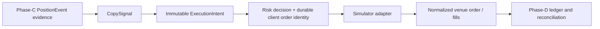

# Phase D — execution foundation and hardening

Phase D is the safety boundary between a Phase-C economic copy decision and a
future venue action. D.0 establishes durable contracts and a deterministic
simulator. It cannot transmit a live order: it contains no HTTP order client,
signing code, private-key handling, credential configuration, or live adapter.
`CopyTradeConfig` continues to reject copy-trading `live` mode even if both
existing opt-in environment variables are set.

## Boundary and ownership

Phase C owns public-source evidence, reconstruction, campaign interpretation,
operator activation, and the economic `CopySignal`. Its existing paper
execution path remains authoritative for paper sleeves.

Phase D owns whether an immutable signal may enter an execution lifecycle,
the durable identity submitted to a venue, risk/admission evidence, normalized
venue responses, actual fills, reconciliation observations, and execution
health. It never rewrites a Phase-C signal or paper record. An altered
economic action must be represented by another intent linked through
`supersedes_intent_id`; it cannot update a prior intent.

The Phase-D contract version is `PHASE_D_EXECUTION_CONTRACT_VERSION = 1`.
Readers reject any other version instead of silently reinterpreting an intent.
The deterministic intent ID derives from this version and `signal_id`; the
submission/client-order IDs derive from `intent_id`.

## Durable ledger

All tables are additive and use the `phase_d_` namespace. Existing
`copy_execution_claims`, `copy_execution_attempts`, and
`copy_execution_fills` retain their paper/research meaning.

| Table | Responsibility |
| --- | --- |
| `phase_d_execution_intents` | Immutable C→D contract, domain/account ownership, current lifecycle state, provenance, schema version |
| `phase_d_execution_state_events` | Append-only legal transition history |
| `phase_d_execution_risk_decisions` | Admission decision and structured evidence before submission |
| `phase_d_execution_submissions` | One deterministic client-order identity per intent, with monotonic venue evidence |
| `phase_d_execution_fills` | Deduplicated normalized venue fills, executed side, and raw evidence |
| `phase_d_execution_reconciliation_runs/items` | Independently-scoped intent-order, position, open-order, and verified-flat evidence and discrepancies |
| `phase_d_execution_position_observations` | Local-fill-derived exposure compared with venue observations |
| `phase_d_execution_integrity_issues` | Immutable contradictions such as conflicting IDs, side conflicts, and overfills |

Every Phase-D row is scoped by `execution_domain` and `execution_account_id`.
Simulator lifecycle work uses `SIMULATOR` / `SIMULATOR:default`; the legacy
paper compatibility projection uses `PAPER_COMPAT` /
`PAPER_COMPAT:legacy_paper`. These domains are never combined for local
positions, admission, reconciliation health, or the simulator control read
model. PAPER_COMPAT remains available as a distinct audit projection.

`CopyTradeDatabase.prepare_execution_submission()` writes the submission row
and transitions the intent to `SUBMITTING` in one SQLite `BEGIN IMMEDIATE`
transaction before the adapter can be called. A concurrent worker that finds
the prepared identity reconciles it; it does not submit it again.

## State machine

The durable states are `CREATED`, `VALIDATING`, `BLOCKED`, `READY`,
`SUBMITTING`, `SUBMISSION_UNKNOWN`, `ACKNOWLEDGED`, `PARTIALLY_FILLED`,
`FILLED`, `CANCEL_PENDING`, `CANCELLED`, `REJECTED_BY_VENUE`, `EXPIRED`,
`RECONCILIATION_REQUIRED`, and `TERMINAL_ERROR`.

The transition table is explicitly encoded in
`execution_contracts.LEGAL_EXECUTION_TRANSITIONS` and rejects illegal changes.
Stale acknowledgements cannot move a terminal order backward. The one notable
exception is `CANCELLED → FILLED`: a fill that demonstrably raced a cancel is
stronger evidence than the old cancel acknowledgement. Late partial fills
remain fills on a cancelled remainder, so the final order state stays
`CANCELLED` while the final deduplicated fill quantity is retained.

## Idempotency and restart semantics

- A unique `signal_id` in `phase_d_execution_intents` prevents duplicate
  Phase-C delivery from becoming a second intent.
- Intent fields and provenance are compared on duplicate intake; a
  non-equivalent record raises rather than rewriting history.
- A unique deterministic `client_order_id` and the prepare transaction make
  concurrent submission workers converge on one external request.
- `venue_fill_id` is globally unique and duplicate/out-of-order delivery has
  one accounting effect only when the immutable fill economics agree. A
  conflicting reuse is recorded as an integrity issue, not ignored.
- Submission evidence is monotonic: stale acknowledgements cannot regress a
  terminal/cancelled state or decrease recorded fill quantity. A conflicting
  non-null venue-order ID is an integrity issue and is never overwritten.
- A restart at `CREATED`/`VALIDATING` or `READY` requires a newly supplied,
  explicit safety/admission context; it does not infer health from defaults.
  A restart at
  `SUBMITTING`, `SUBMISSION_UNKNOWN`, or `RECONCILIATION_REQUIRED` reconciles;
  it never blindly invokes `submit` again.

## Failure and reconciliation semantics

A timeout, lost acknowledgement, or adapter exception after durable
preparation is `SUBMISSION_UNKNOWN`, not venue rejection. The engine queries
the adapter using the deterministic client ID and records a reconciliation run.
Authoritative evidence may converge to `ACKNOWLEDGED`, `PARTIALLY_FILLED`,
`FILLED`, or `REJECTED_BY_VENUE`. Missing fill evidence for a venue-reported
fill quantity becomes `RECONCILIATION_REQUIRED`; the ledger never fabricates a
fill just to make local accounting match a venue position.

Local positions are calculated from deduplicated Phase-D fills using each
fill's executed `BUY`/`SELL` side, never desired intent direction or quantity.
A fill-side conflict, conflicting fill identity/order ID, or overfill is
retained as immutable integrity evidence, makes the intent
`RECONCILIATION_REQUIRED` where transitionable, and makes combined execution
safety unhealthy for that domain/account. This is not merely an entry warning:
opens and adds fail closed, and a reduce/close requires fresh, authoritative,
direction-and-size-bounded position evidence. The same combined check is
repeated at the adapter boundary so a previously `READY` intent cannot submit
after newer safety evidence arrives.

Position and open-order observations are independent latched authorities.
`reconcile_positions()` can clear only position authority. `verify_flat()`
also records an `open_orders` observation; an external open order remains an
entry risk until a newer authoritative `open_orders` observation reports it
clear. A positions-only match and per-intent order reconciliation cannot clear
that latch. The read model combines position authority, open-order authority,
and unresolved integrity evidence and never reports `CONTINUOUS` while any is
unhealthy. D.0 deliberately has no automatic rebaseline: any future
verified-flat recovery must be an explicit, audited operator action.

## Risk and exit semantics

`D0ExecutionRiskGate` runs before the adapter boundary. It separates:

- `entry_inhibited`: blocks only `INCREASE` intents;
- `hard_transport_stop`: blocks every adapter write; and
- recovery, market-evidence, and reconciliation health inputs that block new
  exposure but do not casually remove a safe reduction.

`REDUCE` and `FLATTEN` intents use `reduce_only=True` in the normalized
submission request. During degraded combined safety — reconciliation authority
or unresolved integrity evidence — an exit requires a current authoritative
verified position snapshot; otherwise it is blocked as
`reduce_only_verified_position_required`. Once that snapshot is present, D.0
still rejects an exit that would exceed it or reverse its direction using
`reduce_only_size_exceeds_position` or `reduce_only_direction_mismatch`.

## Adapter and simulator

`ExecutionAdapter` is venue-neutral and exposes submit/cancel/order/fill,
position/balance, and instrument-metadata operations. D.0 enforces
`adapter_mode == "SIMULATOR_ONLY"`; any other adapter is rejected at engine
construction.

`DeterministicExecutionSimulator` provides immediate and partial fills,
rejection, acceptance/rejection timeouts, delayed acknowledgement, duplicate
fills, late fills after cancellation, hidden/stale order reads, and injected
position mismatches. It is the fault-injection lab for D.1–D.3.

## Operator read model

`GET /api/execution` and the Control Center health response read only the
Phase-D database ledger. They expose simulator-only mode, entry/transport
state shape, reconciliation, unknown submissions, outstanding/partial orders,
position mismatches, local exposure, recent intents, and recent fills. There
is no execution control or live-enable route.

## Remaining roadmap

## D.1 deterministic simulator

D.1 turns the simulator into a scriptable venue-side state machine. A
`SimulatorScenario` is an explicit ordered list of `SimulatorStep`s and a
`SimulatedClock`, so replay is reproducible without sleeps or wall-clock IDs.
Scripts can emit fills before acknowledgement, delay visibility until a query,
duplicate fills, hide/stale order or position reads, inject temporary
unavailability, and create independent manual orders or positions. The
simulator owns its orders, fills, positions, and external activity in memory;
it never reads the local Phase-D SQLite ledger to answer reconciliation.

Timeout-before-acceptance, timeout-after-acceptance, timeout-after-rejection,
and timeout-after-fill remain different outcomes. All begin conservatively as
`SUBMISSION_UNKNOWN` unless the simulator supplies authoritative rejection;
only reconciliation changes that state. A cancellation never removes an
already emitted fill, and duplicate fill artifact IDs are intentionally
delivered to prove ledger deduplication.

## D.2 paper execution integration

New durable PAPER attempts write their Phase-D intent, decision, submission,
fill, and transition evidence inside the existing atomic paper commit. That
transaction remains the sole economic authority for legacy claims, virtual
sleeves, simulated fills, and portfolio snapshots, so the compatibility
projection cannot double-apply a sleeve or P&L mutation. The projection is
explicitly tagged `PAPER_COMPAT` / `PAPER_COMPAT:legacy_paper`, preventing
paper economics from becoming simulator exposure or simulator reconciliation
authority.

Because PAPER evidence is already terminal at that point, its compatibility
projection writes one immutable terminal event with the semantic lifecycle in
its evidence instead of replaying intermediate transitions as separate SQLite
writes. Future venue adapters continue to use the full live state machine.

The bridge also repairs a missing D projection on restart from an already
committed `copy_execution_attempt` and `copy_execution_fills` record. These
legacy rows retain their original meaning and are never rewritten. A skipped
paper entry becomes a durable D `BLOCKED` intent with its original reason;
legitimate paper reductions/closes remain projected as `FILLED` intents.

## D.3 reconciliation and chaos hardening

`DeterministicFaultInjector` creates reproducible process-loss analogues at
intent persistence, state transitions, submit, acknowledgement, fill
persistence, cancellation, and reconciliation checkpoints. A fault never
creates a retry path: a persisted submission identity resumes through
reconciliation and venue fill IDs remain deduplicated by the ledger.

Position reconciliation now records `INCOMPLETE` for adapter failure, stale
or freshness-unknown observations, and an interrupted observation pass.
Manual simulator positions are labelled `UNKNOWN_POSITION`, and quantity,
direction, and missing-local/missing-venue cases carry distinct reasons.
D.3.2 gives position, open-order, and integrity evidence independent authority:
a matched positions-only run cannot clear an external open-order failure, and
every unresolved integrity failure makes combined execution safety unhealthy.
The read model exposes each authority and never calls health `CONTINUOUS`
while one remains degraded. It does not rewrite local fill provenance.

`verify_flat()` is evidence-only. It succeeds only when the adapter reports
a fresh position observation, no local or venue position, no open order able
to create exposure, and no submission in an ambiguous/in-flight state. It
records a reconciliation run but does not rebaseline, delete, or invent any
history. An explicit operator rebaseline remains future work.

| Degraded condition | OPEN / ADD | REDUCE / CLOSE | CANCEL |
| --- | --- | --- | --- |
| Position mismatch or stale/unavailable reconciliation | Blocked | Only when caller supplies a direction-and-size-bounded verified position | Existing cancellation may reconcile; no blind retry |
| External open order or unavailable open-order observation | Blocked until a newer open-order observation is clear | Only when caller supplies a direction-and-size-bounded verified position | Existing cancellation may reconcile; no blind retry |
| Unresolved integrity failure (overfill, side/ID conflict) | Blocked | Only when caller supplies a direction-and-size-bounded verified position | Existing cancellation may reconcile; no blind retry |
| Unknown/in-flight increasing submission | Blocked | Available if independently bounded | Reconcile first |
| Direction mismatch | Blocked | Blocked when it would increase the observed opposite exposure | Reconcile first |
| Hard transport stop | Blocked | Blocked because no safe adapter action can be transmitted | Blocked |

- **D.4:** add a strictly read-only real-venue shadow adapter for metadata and
  account comparison; still no signing or order writes.
- **D.5:** separately review a live adapter skeleton with multiple independent
  enablement gates, credential isolation, and explicit acceptance. No D.0
  configuration can make capital move.
