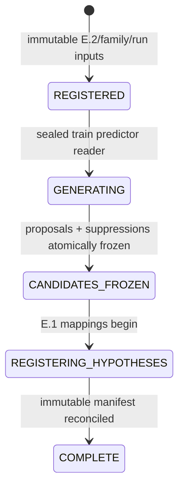

# Phase E.3 — Outcome-Blind Hypothesis Generation

E.3 turns verified E.2 predictor evidence into a small, frozen universe of
falsifiable questions. It does not evaluate labels, calculate an effect,
backtest, rank by return, make a prediction, qualify a signal, or trade.

## Trust and data boundary

Before every plan, run, or verification, E.3 calls E.2's completed-artifact
verification. That sealed integrity operation returns fingerprints only to
E.3. E.3 then opens a separate SQLite connection whose authorizer allow-lists
only these predictor relations:

- `phase_e_materializations`
- `phase_e_materialization_membership`
- `phase_e_materialization_features`
- `phase_e_materialization_sampling_design`

Any other relation, including E.2 outcome artifacts, outcome labels,
experiment results, legacy discovery/result records, forward outcomes, or
performance records, is denied by SQLite before a value can be read. An
internal attempted violation fails closed and is recorded in
`phase_e_generation_access_violations`. A completed run records zero outcome
reads; the E.2 verifier's own label-integrity work is not an E.3 data read and
does not expose labels to the generator.

The predictor reader filters `partition_name='train'` in its SQL. Validation
and test feature values never contribute to coverage, thresholds, support,
ordering, or budgets.

## Immutable contracts

`src/phase_e/generation.py` provides:

- `HypothesisFamilySpec`: an immutable, versioned search-space declaration;
- `StatisticalTestPlan`: E.4 test semantics declared before evaluation;
- `Predicate`: canonical typed AST nodes (`GT`, `GE`, `LT`, `LE`, `EQ`,
  `BETWEEN`, and canonical `AND` for a later explicit interaction family);
- `GenerationRunSpec`: exact E.2/family/generator identity; and
- `HypothesisProposal`: a candidate with predictor-only support and a frozen
  E.1 definition mapping.

Initial generation permits only single-feature predicates. The AST can express
an explicit conjunction later, but E.3 does not do cartesian feature searches.
Wallet IDs, wallet-address features, symbols, and asset identity features are
rejected as unconstrained memorization dimensions.

## Thresholds, support, budgets, and duplicates

The initial versioned policies are:

- `FIXED_THRESHOLD_V1` for family-declared finite values;
- `SIGN_SPLIT_V1` for the meaningful zero split; and
- `TRAIN_QUANTILE_V1`, using nearest-rank selected observed **training**
  values.

Candidate ordering is solely feature declaration order, numerical threshold,
operator order, and predicate hash. Predictor-only suppression reasons include
unavailable/all-missing/low-coverage features, zero or insufficient support,
empty comparator, semantic duplicates, and per-feature/family budgets. Every
suppression persists in the E.3 candidate graveyard. Identical canonical
predicates occupy one slot, even where separate quantiles selected the same
observed threshold.

Every eligible proposal belongs to a frozen multiple-testing family derived
from the run, materialization, family/test-plan versions, horizon, and
comparator. The exact ordered proposal list yields a hypothesis-universe
fingerprint before E.1 registration begins.

## Lifecycle and persistence



E-owned tables keep families, runs, append-only events, proposals,
suppressions, E.1 mappings, manifests, and access-violation evidence.
Triggers prevent changing/deleting frozen inputs, candidates, mappings, and
manifests. Reads replay transition semantics and proposal/mapping hashes, so a
valid-looking projection status cannot make an incomplete run trusted.

A process can restart in `GENERATING` or `REGISTERING_HYPOTHESES`: candidate
freeze is atomic and E.1 mapping insertion is idempotent. Concurrent builders
share deterministic identities and converge on the one frozen universe.

## E.1 and E.2 lineage

Each eligible proposal stores its predicate, support/missing/population counts,
threshold provenance, E.2 fingerprints, multiple-testing family, and a fully
defined E.1 `HypothesisDefinition`. E.1 registration is only performed after
the universe freezes. The mapping preserves the E.1 hypothesis ID/version/hash
and experiment ID. E.4 must verify this mapping and use the declared test plan;
it may not silently substitute a favorable test or comparator.

The plan carries E.2's sampling-design fingerprint and explicitly declares
whether sampling weights are required. The initial test plan refers to the
already documented E.2 net-outcome metric without reading a label in E.3;
E.4 remains responsible for executing that metric's test semantics.

## Initial real family and non-goals

`WALLET_ACTION_SIGN_V1` is the intentionally small control family. Where a
verified materialization contains causal, nonmissing `wallet_action@1`, it
asks the two two-sided questions `wallet_action > 0` and
`wallet_action < 0` at the materialization's exact five-second horizon. It
does not claim alpha. Historical `wallet_action_freshness` is suppressed if
present as explicit missing evidence because archive acquisition latency is
not causal historical predictor evidence.

E.3 excludes historical evaluation, p-values, FDR, robustness, model fitting,
feature invention, result-informed descendants, prediction, signal authority,
paper/live execution, position sizing, leverage, and capital allocation.

## Operator commands

```powershell
python main.py hypothesis-family list --database E:\Beelzebub\runtime\hot\science.sqlite3
python main.py hypothesis-family wallet-action-sign-control --database E:\Beelzebub\runtime\hot\science.sqlite3
python main.py hypothesis-generation plan --database E:\Beelzebub\runtime\hot\science.sqlite3 --materialization e2-... --family-json .\family.json
python main.py hypothesis-generation run --database E:\Beelzebub\runtime\hot\science.sqlite3 --materialization e2-... --family-json .\family.json
python main.py hypothesis-generation verify --database E:\Beelzebub\runtime\hot\science.sqlite3 --generation-run e3-...
```
