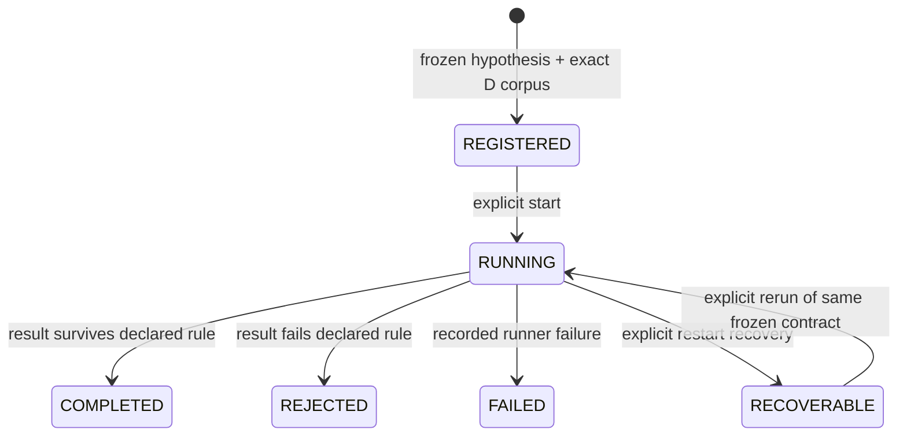
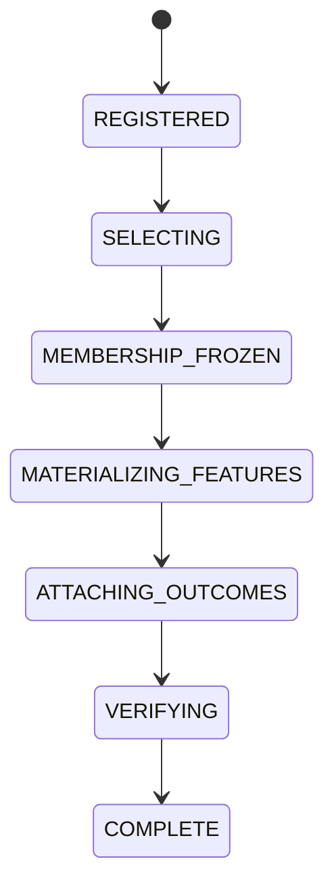

# Phase E — Hypothesis & Learning Engine

## Purpose and boundary

Phase E evaluates whether a *predeclared* relationship in a Phase D corpus has
predictive value. It begins with a scientific ledger and reproducible datasets,
not a trading system.
It reads the D.7 `science_corpus_snapshots` and `science_data_coverage` records
by exact fingerprint but does not write, update, or duplicate D raw evidence.

E.1 writes compact, separate `phase_e_*` tables in the existing hot SQLite
database. This preserves the D.7 hot/cold layout while retaining only contracts,
provenance, lifecycle events, results, and promotion-history evidence.

## E.1 experiment contract

`src/phase_e/types.py` defines explicit immutable types for:

- falsifiable `HypothesisDefinition` versions;
- short `OutcomeHorizon` values: 5, 15, 30, 60, 120, 300, and 600 seconds;
- feature references/transforms, comparator, inclusion and exclusion rules;
- minimum sample/effect thresholds and declared statistical test;
- time-aware train/validation/test `PartitionIdentity`, including horizon,
  purge, embargo, and seed;
- corpus provenance, experiment status/result, rejection reason, and promotion
  state.

Every serializable field rejects NaN, infinity, non-string mapping keys, and
non-deterministic value types. Partitions must be strictly ordered and keep a
horizon-aware purge/embargo gap on both sides of validation.

## Lifecycle

Registration atomically persists the hypothesis, D corpus provenance,
deterministic experiment ID, and append-only registration event before a runner
can start. Experiment identity is a SHA-256-derived ID over the scientific
definition and exact D provenance. Registration time is separately persisted;
it is intentionally not part of the semantic identity material.

SQLite triggers prevent updates or deletes of hypotheses, frozen experiment
inputs, results, lifecycle events, and promotion history. A changed hypothesis
definition requires a new version. A failed/rejected result is retained rather
than replaced.

`NullExperimentRunner` is the deliberately narrow first runner. It only accepts
the predeclared `DETERMINISTIC_NULL_EFFECT` test, recomputes a zero effect from
the frozen corpus metadata, and records a durable rejection. It checks the
runner's declared code/config identity and verifies the D provenance both
before and after evaluation. An interrupted `RUNNING` experiment remains
visible until a later process appends an explicit `RECOVERABLE` event; it is
never silently treated as successful.

## E.1 does not do these things

E.1 does not generate candidates, select predictive features, fit a model,
rank strategies, make a forward prediction, create a qualified signal, place a
trade, allocate capital, or modify Phase D evidence. A promotion request is
persisted as denied because E.1 has no signal authority.

## E.2 materialization and sampling

E.2 lives in `src/phase_e/materialization.py`. It reads Phase D directly and
writes only `phase_e_materialization*` tables. It does not change a
`science_*` table or Phase D's D.7 corpus-snapshot meaning.

The original D.7 snapshot's observation fingerprint deliberately covers the
256 D.6 commissioning anchors. E.2 validates that frozen snapshot/coverage,
then derives a separate E-owned fingerprint over every immutable
`HISTORICAL_OFFICIAL_ARCHIVE` observation in the same end-exclusive interval.
The full retained evidence is therefore reachable without revising D.

An immutable E.2 specification binds D provenance, full source fingerprint,
E.1 partition/horizon/lookback, features, eligibility, sampling
algorithm/version and seed, tier, causal stratification, missing-data policy,
and materializer code/config versions. It freezes membership before it reads
or attaches an outcome. Missing data is an explicit artifact, never a member
deletion or replacement.

`ALL_ELIGIBLE_V1`, `DETERMINISTIC_HASH_V1`, and
`TIME_STRATIFIED_HASH_V1` are initial immutable algorithms. Time buckets use
only information known at the anchor. Final member order is always normalized
timestamp plus observation ID, independent of database return order or worker
timing.

Every E.2 read reconciles projection state against append-only events, frozen
membership, artifact counts, and hashes. The standalone no-trading operator
surface is `python main.py materialization {plan,build,status,verify,reproduce,list}`.

## Roadmap

- E.1 — frozen scientific experiment foundation.
- E.2 — deterministic scientific materialization and sampling.
- E.3 — narrow falsifiable hypothesis generation.
- E.4 — historical experimentation over frozen E.2 artifacts.
- E.5 — robustness, FDR, regime validation, and walk-forward gates.
- E.6 — inspectable confidence accumulation, contradiction, and decay.
- E.7 — prospective forward-shadow learning, still with no trading authority.

Each later stage must retain this lineage:

`signal -> hypothesis/model -> experiment -> Phase D corpus -> raw evidence`.
