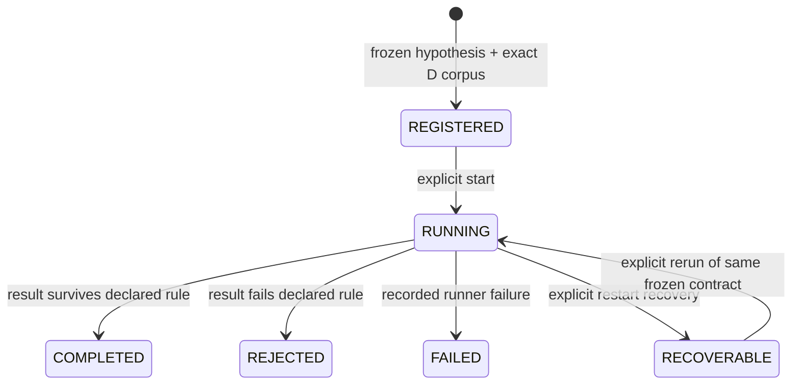

# Phase E — Hypothesis & Learning Engine

## Purpose and boundary

Phase E evaluates whether a *predeclared* relationship in a Phase D corpus has
predictive value. It begins with a scientific ledger, not a trading system.
It reads the D.7 `science_corpus_snapshots` and `science_data_coverage` records
by exact fingerprint but does not write, update, or duplicate D raw evidence.

E.1 writes compact, separate `phase_e_*` tables in the existing hot SQLite
database. This preserves the D.7 hot/cold layout while retaining only contracts,
provenance, lifecycle events, results, and promotion-history evidence.

## E.1 experiment contract

`src/phase_e/types.py` defines explicit immutable types for:

- falsifiable `HypothesisDefinition` versions;
- short `OutcomeHorizon` values: 5, 15, 30, 60, 120, 300, and 600 seconds;
- feature references/transforms, comparator, inclusion and exclusion rules;
- minimum sample/effect thresholds and declared statistical test;
- time-aware train/validation/test `PartitionIdentity`, including horizon,
  purge, embargo, and seed;
- corpus provenance, experiment status/result, rejection reason, and promotion
  state.

Every serializable field rejects NaN, infinity, non-string mapping keys, and
non-deterministic value types. Partitions must be strictly ordered and keep a
horizon-aware purge/embargo gap on both sides of validation.

## Lifecycle

Registration atomically persists the hypothesis, D corpus provenance,
deterministic experiment ID, and append-only registration event before a runner
can start. Experiment identity is a SHA-256-derived ID over the scientific
definition and exact D provenance. Registration time is separately persisted;
it is intentionally not part of the semantic identity material.

SQLite triggers prevent updates or deletes of hypotheses, frozen experiment
inputs, results, lifecycle events, and promotion history. A changed hypothesis
definition requires a new version. A failed/rejected result is retained rather
than replaced.

`NullExperimentRunner` is the deliberately narrow first runner. It only accepts
the predeclared `DETERMINISTIC_NULL_EFFECT` test, recomputes a zero effect from
the frozen corpus metadata, and records a durable rejection. It checks the
runner's declared code/config identity and verifies the D provenance both
before and after evaluation. An interrupted `RUNNING` experiment remains
visible until a later process appends an explicit `RECOVERABLE` event; it is
never silently treated as successful.

## E.1 does not do these things

E.1 does not generate candidates, select predictive features, fit a model,
rank strategies, make a forward prediction, create a qualified signal, place a
trade, allocate capital, or modify Phase D evidence. A promotion request is
persisted as denied because E.1 has no signal authority.

## Roadmap

E.2 can add narrow deterministic candidate templates that emit these contracts.
E.3 can add historical evaluators over the frozen partitions. E.4 adds
walk-forward/FDR/robustness gates; E.5 adds inspectable evidence decay; E.6
adds prospective shadow predictions; E.7 alone may define revocable signal
qualification. Each later stage must retain this lineage:

`signal -> hypothesis/model -> experiment -> Phase D corpus -> raw evidence`.
