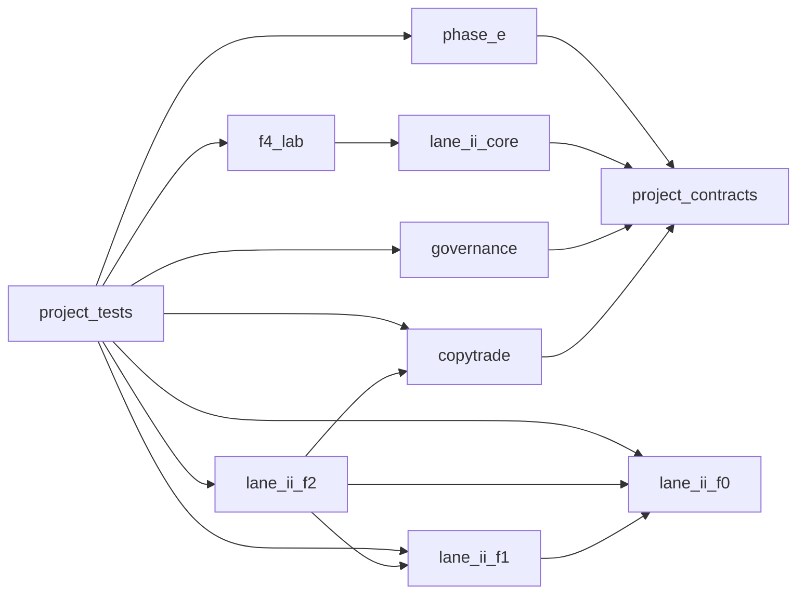

# F5 architecture map

This static map distinguishes dependency flow from authority and evidence policy; it grants no authority.

- Dependency flow: static import edges above.
- Data/control/authority flow: constrained by each component record and frozen manifests.
- Evidence flow: immutable F4 packages and F5 commissioning evidence are external archival artifacts.
